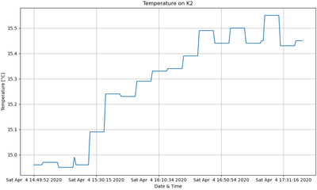

# Program K2-Meteo

## Recording and display current weather and forecast on K2 mountain. 

### Task description:
>Do wyprawy na K2 przygotowuje się grupa nieokrzesanych śmiałków, oczywiście jak na prawdziwych profesjonalistów przystało o sprawdzeniu pogody przypomniało im się na 3 dni przed wylotem do Islamabadu.
>Grupa koniecznie musi monitorować aktualne dane pogodowe oraz prognozę na najbliższe 5 dni.
>Jesteś ich ostatnią nadzieją. Musisz przygotować prosty skrypt, który spełnia następujące założenia:
>
>1. Jest dostępny na GitHub'ie.
>2. Napisany w Python.
>4. Pełna historia commitów w języku angielskim.
>5. Wszystkie zewnętrzne biblioteki zapisane w pliku requirements.txt.
>6. Dane powinny być zapisywane do bazy danych SQLite w czasie rzeczywistym.
>7. Prognoza pogody dostępna na wykresie.
>8. Możliwość pobrania z bazy danych min, max, avg. dla temperatury z całego okresu składowania danych.
>9. Prosta dokumentacja użycia.
>
>Dane pobieramy ze strony:
>https://openweathermap.org/api
>
>Należy założyć darmowe konto oraz poczekać na aktywację klucza, który należy następnie użyć podczas pobierania danych.
>
>Pozycja K2 = {"lat": "35.88", "lon": "76.51"}
>
## Table of contents

1. [Technologies](#technologies)
2. [Installation](#installation)
3. [Running](#running)
4. [Program instruction](#instruction)
2. [Status](#status)
3. [Contact](#contact)

## Technologies

- Python v3.7
- SQLite
- OpenWeatherMap

## Instalation

To start this program you need to have installed python. If you don't have it, go to Python [download](https://www.python.org/downloads/) section and install it.
Next step run "Command Prompt" on your system and go to folder with this project and use command:

    pip install -r requirements.txt

It's done

## Running
First you go to [Installation](#installation) section. Subsequently go to folder with this project and double click to `K2Meteo.py` or 
run "Command Prompt" on your system and go to folder with this project and use command:

    pytohn K2Meteo.py
    

## Instruction

Program used to display and register data from externally weather data source. After running program in background is recording data each one minute. Data is recorded to local database.
In program you can use a few command, it's:

 - _help_ - Display available commands and purpose.
 - _weather_ - Display current temperature on K2.
 - _forecast_ - Display forecast weather in 5 days on K2.
 - _max_ - Display max registered value on database.
 - _graph_ - Plot graph and save picture on your disc.
 - _exit_ - Close program.

## Status
Project is: _done_ 5-04-2020

To do:
 - [x] Main Branch
    - [x] SQLite
        - [x] Create database
        - [x] Add data do database
        - [x] Read max value from database
    - [x] OpenWeatherMap
        - [x] Read current weather data and forecast
        - [x] Recording current weather data   
        - [x] Reading forecast 
    - [x] Graph
        - [X] Generate graph and save to file
    - [x] UI 
        - [x] Command structure
    - [x] Register data in Real-Time
 - [x] Readme
    - [x] Instruction
   
#### Database table

##### Table 1. current_weather

| DataId | DateTime         | Temp | TempMin | TempMax |
| :---:  |:---:             |:---: |:---:    |:---:    |
| 1      | 2020-04-04 12:00 | 24.5 |  20.5   | 24.5    |
| 2      | 2020-04-04 12:00 | 24.4 |  20.5   | 24.5    |
| ..     | ...              | ...  |  ...    | ...     |
   
#### Graph

After each plot graph it will be saved on this path:
      
      K2Meteo -> Data
 
Example graph:

 
## Contact
Created by [pjuszcze@gmail.com](mailto:pjuszcze@gmail.com?subject=K2-Meteo Program)